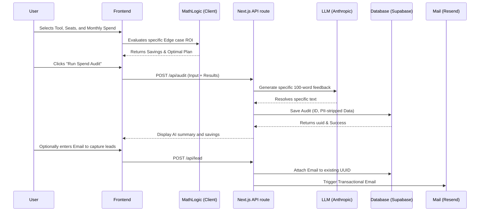

# Architecture

## System Data Flow

## Why this stack? (Next.js / Supabase / Anthropic)
- **Next.js:** Server Actions and Edge APIs make spinning up lightweight transactional lead forms seamless without needing an explicit Express/Django backend, cutting latency.
- **Supabase:** Instant Postgres schema modeling with automatic PostgREST bridging. 
- **Anthropic:** Claude 3 Haiku is lightning fast and relatively cheap for <200 token localized outputs.

## 10k Audits/Day Evolution
If this tool scaled to 10k requests/day:
1. **Edge DB:** Move Supabase to a distributed Read-Replica structure or switch to Cloudflare D1 to eliminate latency geographically.
2. **LLM Queuing:** Wrap the `/api/audit`Anthropic call inside a \`Redis / Inngest / Upstash\` queue to prevent hitting Anthropic rate limits, processing LLM summarization asynchronously and streaming it up via SSE.
3. **Caching:** Statically cache the pricing models globally via \`getStaticProps\` or KV.
