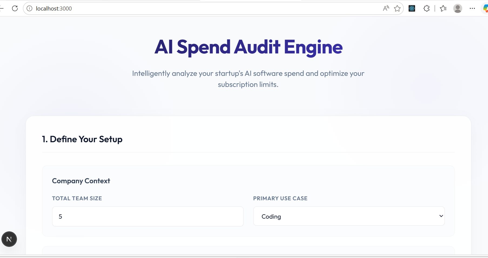
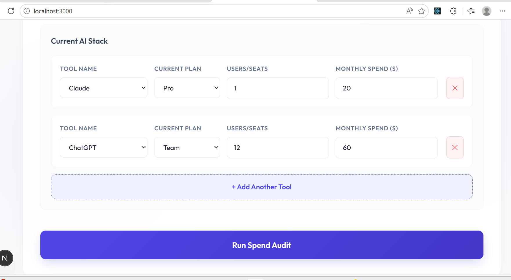
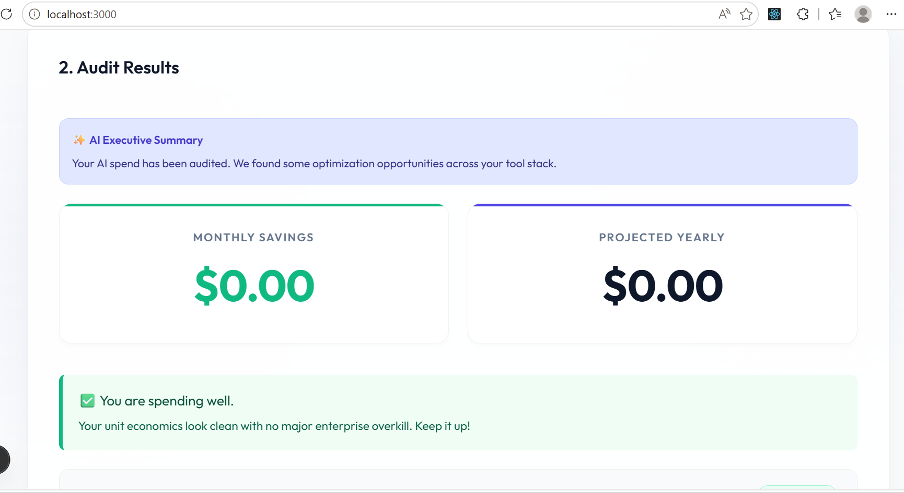
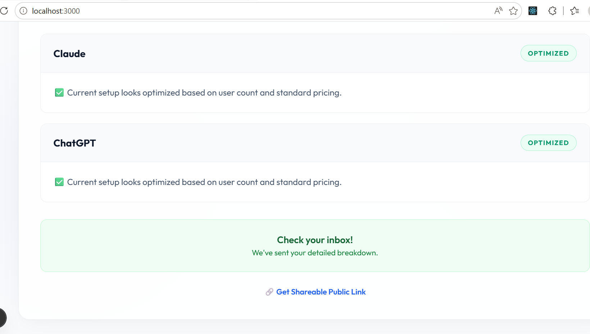
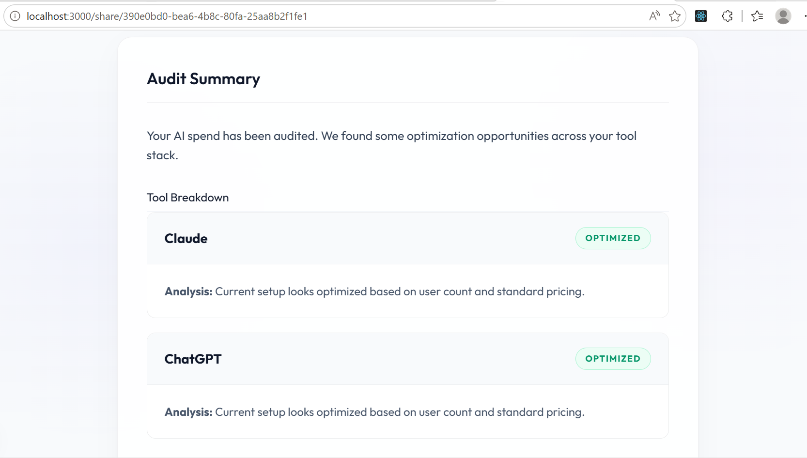

🚀 Credex AI Spend Audit Engine

The Credex AI Spend Audit Engine is a lightweight financial intelligence tool for startups that reveals hidden overspending across AI tools like ChatGPT, Claude, Cursor, and Copilot.

It analyzes real subscription usage, seat counts, and plan tiers to identify inefficient enterprise plans, underutilized seats, and better-cost alternatives.

The goal is simple:

Help startups immediately understand their AI burn — and unlock meaningful savings in under 30 seconds.

This tool also acts as a lead-generation engine for Credex, surfacing companies with high optimization potential and routing them toward volume-discounted AI credits.

🌐 Live Demo
👉 Live URL: ai-spend-audit-dashboard.vercel.app

📸 Screenshots
### Dashboard

### Results Page

### Shareable Report

⚡ Quick Start
1. \`npm install\`
2. Duplicate \`.env.example\` to \`.env.local\` and add your \`NEXT_PUBLIC_SUPABASE_URL\`, \`ANTHROPIC_API_KEY\`, and \`RESEND_API_KEY\`.
3. Run \`npm run dev\` and access the frontend at \`localhost:3000\`.

🧠 Key Product Decisions & Trade-offs
1. Local-first Audit Engine (No backend compute)
All pricing logic and optimization decisions are executed on the client side to reduce backend cost and latency. The server is only used for persistence and AI summarization.

2. Deterministic Finance Logic > LLM reasoning
Core audit recommendations are rule-based and deterministic (not AI-generated) to ensure:
predictable outputs
explainable savings calculations
audit reliability for financial use cases

3. No Authentication Gate
Authentication was intentionally removed from the user journey to maximize conversion.
Instead:
value is shown first
email is captured after insights are delivered
This increases lead capture rates significantly in B2B funnels.

4. Vanilla CSS over Tailwind
Chosen for:
tighter UI control
reduced styling abstraction
fewer hydration-related inconsistencies in Next.js App Router

5. Lightweight Backend Strategy
Next.js API routes are used only for:
AI summary generation
lead capture
email delivery (Resend)

This keeps architecture minimal and production-efficient.

🔗 Architecture Summary

React (client) handles form + interaction layer
Audit engine runs deterministic cost analysis
API routes handle:
LLM-generated summaries
Supabase lead storage
transactional email delivery
Shareable /share/[id] routes generate public audit reports

🚀 What Makes This Product Valuable

Detects real AI subscription waste in seconds
Converts audits into high-intent enterprise leads
Designed as a viral “shareable insight” tool
Bridges cost optimization + SaaS lead generation
